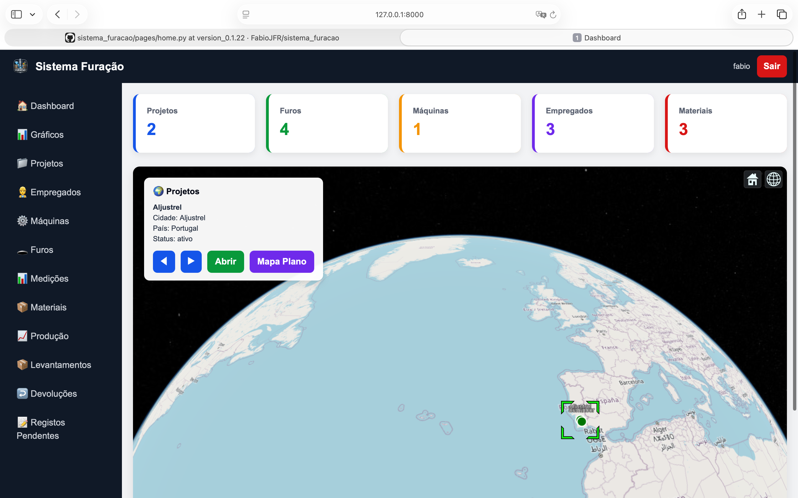
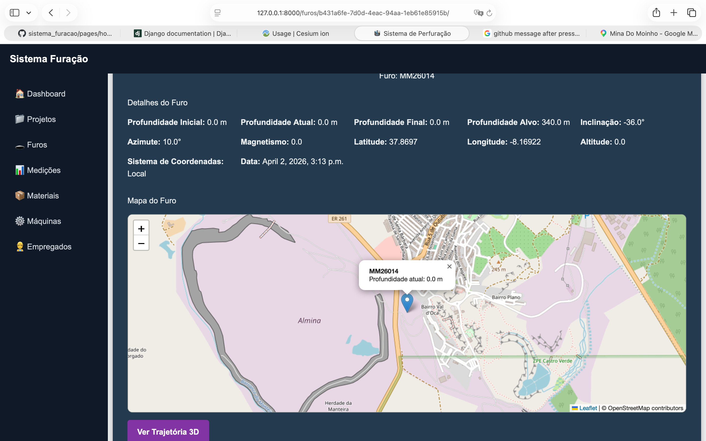
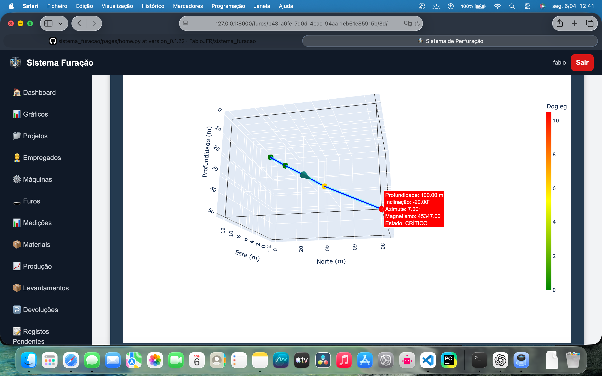
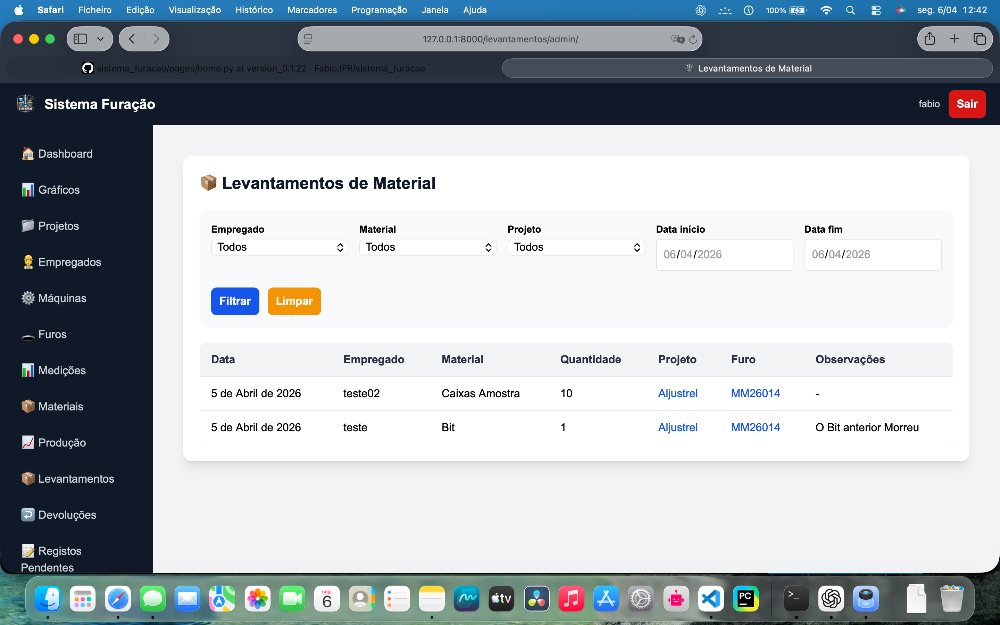

# 🛠️ Sistema de Gestão de Diamond Drilling

Sistema web desenvolvido em **Django** para gestão operacional de projetos de perfuração (diamond drilling), com foco em controlo de produção, materiais, equipamentos e análise de dados em tempo real.

---

## 🚀 Funcionalidades

### 📁 Projetos
- Gestão completa de projetos
- Localização geográfica
- Visualização em mapa (Leaflet) e globo 3D (Cesium)

### 🕳️ Furos
- Criação e gestão de furos
- Associação a projetos
- Dados técnicos (profundidade, inclinação, azimute, etc.)
- Visualização 3D da trajetória (Plotly)

### 📊 Produção
- Registos diários por empregado
- Metros furados
- Horas trabalhadas
- Cálculo automático de produtividade

### 👷 Empregados
- Área dedicada
- Total de metros furados
- Estatísticas acumuladas
- Histórico de trabalho

### ⚙️ Máquinas
- Gestão de equipamentos
- Estados (ativo, avariado, em reparação, parado)
- Associação a projetos

### 📦 Materiais & Stock
- Controlo de stock
- Stock mínimo
- Alertas automáticos

### 🔄 Movimentos de Material
- Levantamento por empregado
- Devolução ao stock
- Histórico completo

### 📈 Dashboard
- Indicadores operacionais
- Gráficos (Chart.js)
- Produtividade por:
  - dia
  - empregado
  - projeto
  - furo

### 🌍 Visualização Avançada
- Mapa interativo
- Globo 3D (Cesium)
- Trajetória de furos em 3D

---

## 🖼️ Screenshots

### Dashboard

### Mapa / Globo

### Visualização 3D

### Gestão de Stock

---

## 🧰 Tecnologias

- **Backend:** Django 6, Python 3.14
- **Frontend:** HTML, CSS, JavaScript
- **Gráficos:** Chart.js
- **Mapas:** Leaflet
- **Globo 3D:** CesiumJS
- **3D Furos:** Plotly

---

## 🔐 Autenticação

- Sistema de login
- Registo com aprovação por administrador
- Controlo de permissões (admin / empregado)

---

## ⚡ Objetivo

Este sistema foi desenvolvido para:
- melhorar o controlo operacional em campo
- centralizar informação de perfuração
- aumentar a rastreabilidade dos dados
- facilitar análise de produtividade
- reduzir erros e perda de informação

---

## 📌 Estado do Projeto

🚧 Em desenvolvimento ativo  
Versão atual: **v0.7.0-beta**

---

## 🧑‍💻 Autor

Desenvolvido por **Fabio Revez**  
Projeto focado em integração entre tecnologia e operações de perfuração.

---

## 📬 Contacto

Se tiver interesse no projeto ou quiser colaborar, entre em contacto.

---

## ⭐ Contribuição

Sugestões e melhorias são bem-vindas!
