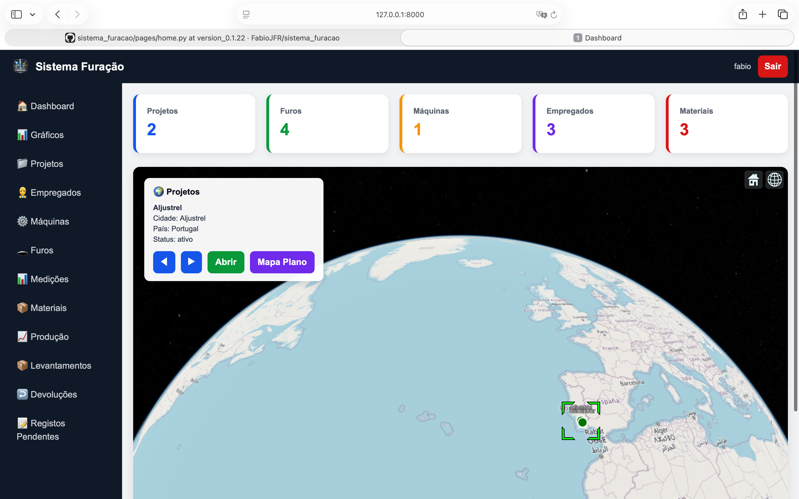
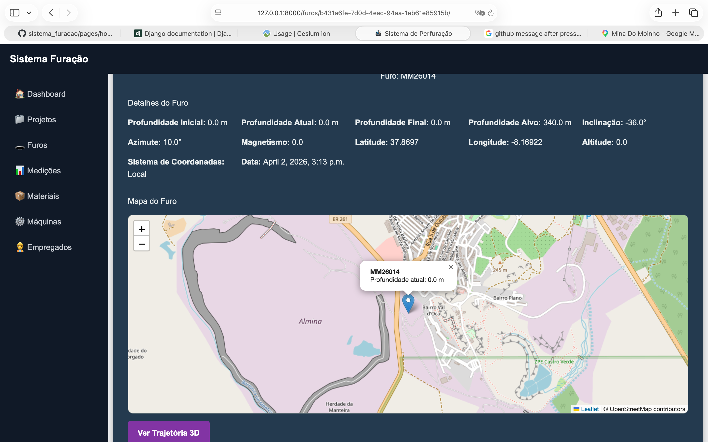
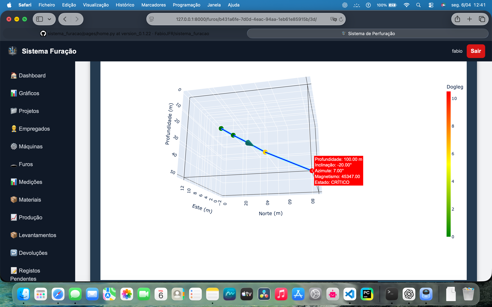
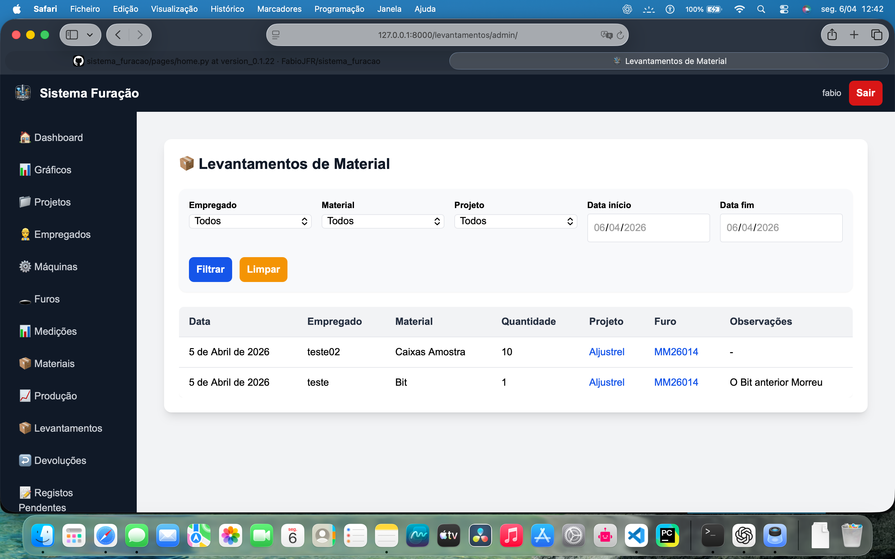

# 🛠️ Sistema de Gestão de Diamond Drilling

Sistema web desenvolvido em **Django** para gestão operacional de projetos de perfuração (**diamond drilling**), com foco em controlo de produção, materiais, equipamentos e análise de dados em tempo real.

---

## 🚀 Funcionalidades

### 📁 Projetos
- Gestão completa de projetos
- Localização geográfica
- Visualização em **mapa (Leaflet)** e **globo 3D (Cesium)**

### 🕳️ Furos
- Criação e gestão de furos
- Associação a projetos
- Dados técnicos:
  - profundidade
  - inclinação
  - azimute
- Visualização 3D da trajetória (**Plotly**)

### 📊 Produção
- Registos diários por empregado
- Metros furados
- Horas trabalhadas
- Cálculo automático de produtividade

### 👷 Empregados
- Área dedicada
- Total de metros furados
- Estatísticas acumuladas
- Histórico completo

### ⚙️ Máquinas
- Gestão de equipamentos
- Estados:
  - ativo
  - avariado
  - em reparação
  - parado
- Associação a projetos

### 📦 Materiais & Stock
- Controlo de stock
- Definição de stock mínimo
- Alertas automáticos

### 🔄 Movimentos de Material
- Levantamento por empregado
- Devolução ao stock
- Histórico completo

### 📈 Dashboard
- Indicadores operacionais em tempo real
- Gráficos (**Chart.js**)
- Produtividade por:
  - dia
  - empregado
  - projeto
  - furo

### 🌍 Visualização Avançada
- Mapa interativo
- Globo 3D (**CesiumJS**)
- Trajetória de furos em 3D (**Plotly**)

---

## 🖼️ Screenshots

### Dashboard


### Mapa / Globo


### Visualização 3D


### Gestão de Stock


---

## 🧰 Tecnologias

- **Backend:** Django 6, Python 3.14
- **Frontend:** HTML, CSS, JavaScript
- **Gráficos:** Chart.js
- **Mapas:** Leaflet
- **Globo 3D:** CesiumJS
- **Visualização 3D:** Plotly

---

## 🔐 Autenticação

- Sistema de login
- Registo com aprovação por administrador
- Controlo de permissões:
  - Administrador
  - Empregado

---

## ⚡ Objetivo

Este sistema foi desenvolvido para:

- melhorar o controlo operacional em campo  
- centralizar informação de perfuração  
- aumentar a rastreabilidade dos dados  
- facilitar análise de produtividade  
- reduzir erros e perda de informação  

---

## 📌 Estado do Projeto

🚧 Em desenvolvimento ativo  

👉 Versão atual: **v0.9.0-beta**

---

## 🧭 Roadmap

Próximos passos:

- Integração com dispositivos de medição (ex: sondas / sensores)
- Melhorias nos dashboards e análise de dados
- Sistema de notificações e alertas avançados
- Otimização para ambiente de produção

---

## 🧑‍💻 Autor

Desenvolvido por **Fabio Revez**  
Focado na integração entre **tecnologia e operações de perfuração**

---

## 📬 Contacto

Se tiver interesse no projeto ou quiser colaborar, entre em contacto.

---

## ⭐ Contribuição

Sugestões e melhorias são bem-vindas!

## 🐳 Postgres com Docker

Para começar a usar o PostgreSQL em Docker:

1. Criar o ficheiro `.env` a partir de `.env.example`
2. Subir a base de dados com `docker compose up -d`
3. Aplicar migrações com `python3 manage.py migrate`
4. Iniciar o projeto normalmente

Exemplo rápido:

```bash
cp .env.example .env
docker compose up -d
python3 manage.py migrate
python3 manage.py runserver
```

Notas:

- O Django agora lê `POSTGRES_DB`, `POSTGRES_USER`, `POSTGRES_PASSWORD`, `POSTGRES_HOST` e `POSTGRES_PORT` a partir do ambiente.
- Se no futuro o Django também correr em Docker, o `POSTGRES_HOST` deve passar de `127.0.0.1` para `db`.
- Os dados ficam persistidos no volume Docker `postgres_data`.
